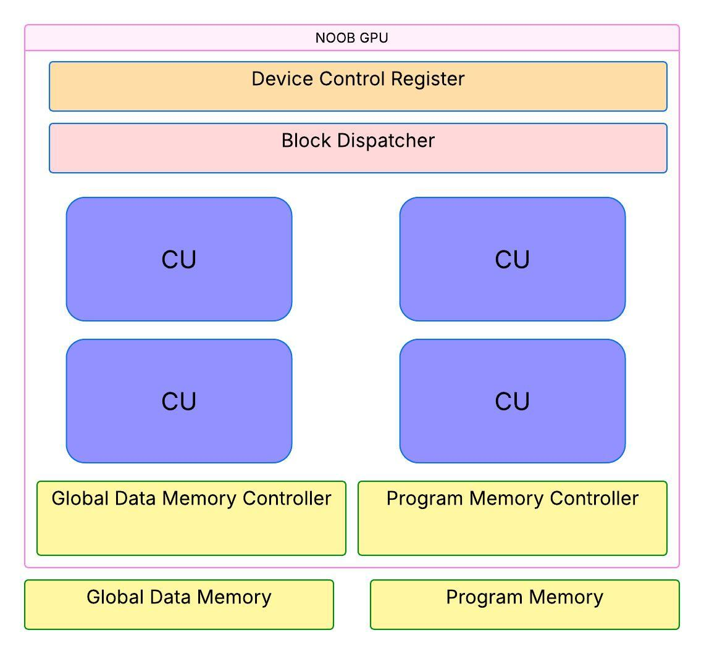
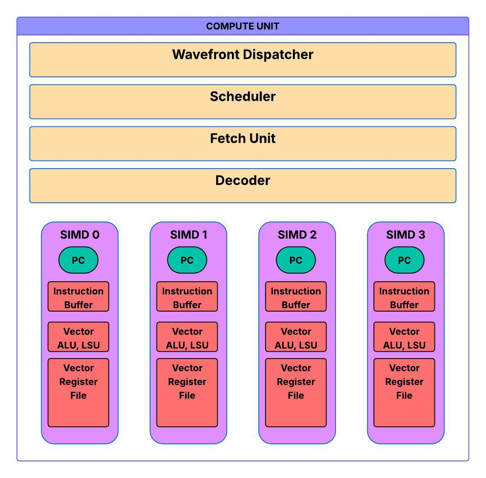

# Noob GPU
## What do GPUs do?  
- GPUs process multiple data streams simultaneously
- They have lower clock speeds than CPUs
- They have higher memory bandwidth than CPUs (optimized for througput)

## Common Terminology and Basic Information
### SIMD/SIMT Paradigm:  
- __SIMT__ - Threads are explicitly defined by programmer; you can see thread ID and are aware of the thread as a unit of execution. 
- __SIMD__ - Lanes are implicit. They are built into GPU hardware and process threads simultaneously.  
GPUs expose the SIMT programmihng model while execution is implemented in GPU compute units/streaming multiprocessors. 

### NVIDIA/AMD Terminology:  
- Kernel - think C functions. Unit of a code program that is called once and returned once but executed many times over multiple threads.
- Thread/Work-item - simplest unit of execution. A sequence of instructions. Think of vector additon C[i] = A[i] + B[i]; each addition can be seen as a thread. For example:  
    - Load A[i] into Vector0 for all lanes
    - Load B[i] into Vector1 for all lanes
    - Add Vector0 and Vector1 and store into Vector2 for all lanes
    - Store Vector2 into memory (C[i]) for all lanes
    
- Thread block/Work-group - smallest unit of thread coordination exposed to programmers.
    - Composed of several threads
    - Each block is assigned to a SM/CU, and a SM/CU can accomodate several blocks
    - Arbitrarily sized (typically multiples of the warp size)

- Warp/Wavefront - Group of threads scheduled together and execute in parallel--these threads have the same operations that need to be executed
    - Each thread block is composed of warps/wavefronts which can be executed in lockstep
    - All threads in a warp are scheduled onto a sigle SM/CU--a single SM/CU can typically store and execute multiple warps/wavefronts
    - The results of the execution may of a warp/wavefront usually do not occur in a single clock cycle
    - For modern GPUs: wavefront size is typically 32 threads 

- Streaming Multiprocessor (SM)/Compute Unit (CU) -The processing heart of GPUs
    - Contains warp/wavefront scheduler and SIMD units (plus others like cache, scalar units, local data share, etc., but those are not important for the purposes of this) 

### Example Pipeline
1. Kernel Launch  
    - Host (CPU) launches the kernel with a grid of thread blocks/work groups. Each block contains many threads/work items.  
    - GPU scheduler sends these blocks to the SMs/CUs.  

2. A wavefront is dispatched/issued to each SIMD unit inside the SM/CU using a scheduling algorithm (like Round-Robin) 
    - Within a block, threads are grouped into wavefronts (AMD GCN1 - 64 threads).  
    - All wavefronts in a block are guaranteed to reside in the same CU.
    - The SM's/CU's scheduler can hold wavefronts from many blocks (GCN1 - 40 wavefronts/CU, up to 10 wavefronts/SIMD unit). The specific amount of wavefronts that can be held by a SIMD unit depend on its resource availability (occupancy).
    - If a wavefront on a SIMD unit stalls (e.g., waiting for memory), the SIMD can switch to another ready wavefront from its buffer, keeping the hardware busy -- aka 'hiding memory latency'.
    - __At each clock cycle__: 
        - The warp scheduler issues a warp/wavefront to one of the SIMD units. 
        - At most 1 instruction per wavefront may be issued.

3. Each SIMD unit executes the same instruction for all the threads in a wavefront in lockstep

4. Repeat until all wavefronts exhausted/done executing in SM/CU

## NOOB GPU Architecture
### GPU
 

### Compute Unit
 


### (Global):
- Global Data Memory (think DRAM) 
- Global Instruction/Program Memory
### GPU
- Device Control Register - stores metadata of how kernels should be executed by GPU, e.g., how many threads for kernel that was launched
- Block Dispatcher - organizes threads into blocks that can be executed in parallel on a CU and dispatches these blocks to available CUs
    - Blocks that can be launched - as many as needed for the kernel workload (queued if all CUs are taken up)
- Memory Controller - coordinates global memory accesses from CUs
- ### Compute Unit (x4)
    - Wavefront Dispatcher - dispatches wavefronts (64 threads/wave) to SIMD units 
        - Considers a wave from one of the SIMD units for execution, selected in a round-robin fashion between SIMDs
    - Instruction Fetch - fetches instructions from memory into SIMD units
    - Instruction Decoder - breaks down an instruction into opcode, source/destination registers, immediate, etc.
    - ###  SIMD Unit (x2/CU)
        - Holds up to one wavefront at a time
        - Program Counter
        - ALU (16 lanes)
        - Load/Store Unit (16)
        - Vector Register File - Registers to store data for up to 1 wavefront

## Architecture Information:
__Doubleword__: 64 bits  
__Word__: 32 bits  

__Instruction format__: Each instruction takes exactly one word.   
__Registers__: 64 bits x 32 registers for each SIMD lane (need 5b for register addresses within in each lane)
- 16 lanes/SIMD unit means 16 x 32 registers = 512 registers/SIMD unit
- 4 KB of data per SIMD unit

__Program Memory__: 32 bits x 64 registers (Up to 64 instructions, need 6b for addresses)  
__Data Memory__: 64 bits x 128 registers = 1 KB data (need 7b for addresses)

## ISA
Instructions have this format: | opcode: 6b | Rd: 7b | Rm: 7b | Rn: 7b | Other: 5b |


| Mnemonic | Instruction Operation | Opcode | Notes
| :---------------- | :------: | :----------------: | :----: |
| LDUR |   LDUR rd, rm | 000000 | Rd = global_mem[Rm]
| STUR |   STUR rn, rm | 000001 | global_mem[Rm] = Rn
| ADD |  ADD rd, rm, rn | 000010 | Rd = Rm + Rn
| MUL |  MUL rd, rm, rn  | 000011 | Rd = Rm * Rn
| DIV |  DIV rd, rm, rn  | 000100 | Rd = Rm / Rn
| AND | AND rd, rm, rn | 000101 | Rd = Rm bitwise_AND Rn
| ORR | ORR rd, rm, rn | 000110 | Rd = Rm  bitwise_OR Rn
| CONST | CONST rd, imm_19 | 000111 | Rd = imm_19 (imm_19 = Rd_Rm_Rn_Other)

## Registers
Each SIMD lane has 64 bits x 32 registers.  
```R0```: zero  
```R1-R3```: %blockIdx, %blockDim, and %threadIdx respectively  
```R4-R31```: general purpose data

**Important parameters**:  
- ```%blockIdx```: block's ID within a block grid (0 through numberOfBlocks-1)
    - Same for all threads in a block
- ```%blockDim```: number of threads per block
    - Same for all blocks
- ```%threadIdx```: thread's ID within a block (0 through blockDim-1)
    - Unique per thread within a block 

**Global Thread Id Calculation**:  
%blockIdx * %blockDim + %threadIdx  

%threadId.x = wave_id * wave_size + (warp_cycle * SIMD_width + lane_id)

## Kernel Examples
### Vector addition
```
.threads 8
.data 0 1 2 3 4 5 6 7 ; matrix A (1 x 8)
.data 0 1 2 3 4 5 6 7 ; matrix B (1 x 8)

MUL R4, %blockIdx, %blockDim 
ADD R4, R4, %threadIdx ; i = blockIdx * blockDim + threadIdx 

CONST R5, #0 ; baseA (matrix A base address) 
CONST R6, #8 ; baseB (matrix B base address) 
CONST R7, #16 ; baseC (matrix C base address) 

ADD R8, R5, R4 ; addr(A[i]) = baseA + i 
LDR R8, R8 ; load A[i] from global memory 

ADD R9, R6, R4 ; addr(B[i]) = baseB + i 
LDR R9, R9 ; load B[i] from global memory 

ADD R10, R8, R9 ; C[i] = A[i] + B[i] 

ADD R11, R7, R4 ; addr(C[i]) = baseC + i 
STR R10, R11 ; store C[i] in global memory 

RET ; end of kernel
```